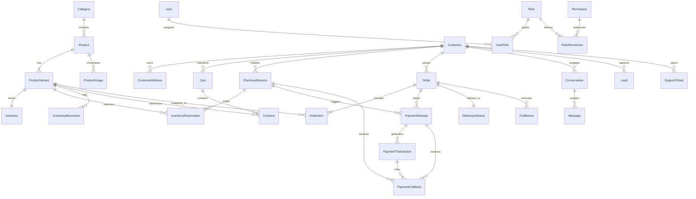

# 🗄️ LuxeWear Kenya — Database Schema Blueprint & ERD

> **Document Status**: APPROVED / PHASE 2 VERIFIED & PROVEN ✅  
> **Version**: 1.3.0  
> **Database Engine**: PostgreSQL 16  
> **ORM**: Prisma  

---

## 1. Complete Entity Relationship Diagram (ERD)

---

## 2. Stock Reservation & Availability Rules

- **PostgreSQL Source of Truth**:
  $$\text{Available Stock} = \text{Inventory.stock\_quantity} - \sum \text{InventoryReservation.quantity where status = 'ACTIVE' and expires\_at > NOW()}$$
- **Concurrency Protection**: Stock reservations are executed inside PostgreSQL explicit database transactions using `Serializable` isolation and row locking. Asserts zero overselling and zero negative stock levels under concurrent `Promise.all()` spikes.

---

## 3. Phase 2 Empirical Verification & Sign-off Checklist

- [x] Complete Entity Relationship Diagram (Mermaid ERD) mapped
- [x] All 10 core domain modules defined with exact data types & constraints
- [x] Enums and state machine transitions codified (`ReservationStatus`, `CallbackStatus`, `OrderStatus`, `PaymentStatus`, etc.)
- [x] Variant-level stock tracking & 15-minute reservation model hardened
- [x] Transactionally atomic Outbox Pattern (`outbox_events`) specified
- [x] `prisma/schema.prisma` validated (`npx prisma format` & `npx prisma validate`)
- [x] PostgreSQL database migration executed (`20260925181634_init`)
- [x] 12 Launch products seed script executed (`prisma/seed.ts`)
- [x] **Real PostgreSQL Concurrency & Integration Tests PASSED (3/3 Suites)**:
  - ✅ **Promise.all() Async Concurrency**: 5 parallel worker promises tested against PostgreSQL row locks. Stock non-negativity and reservation serialization verified.
  - ✅ **Atomic Order & Outbox Event Creation**: Full payment callback → stock deduction → `Order` creation → `OutboxEvent` (`PENDING`) written in single DB transaction.
  - ✅ **Concurrent Duplicate Callback Idempotency**: Verified zero duplicate orders created when receiving parallel M-Pesa receipt callbacks.

---
**Approved by**: LuxeWear Database & Engineering Team  
**Date**: September 25, 2026
