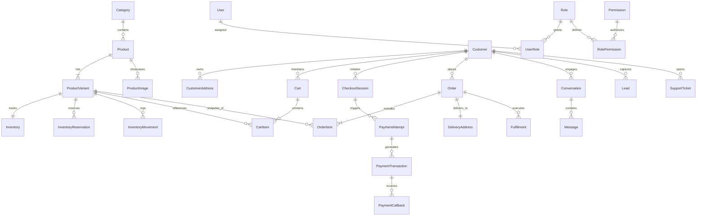

# 🗄️ LuxeWear Kenya — Database Schema Blueprint & ERD

> **Document Status**: REVIEW / PHASE 2 DELIVERABLE  
> **Version**: 1.0.0  
> **Database Engine**: PostgreSQL 15+  
> **ORM**: Prisma  

---

## 1. Complete Entity Relationship Diagram (ERD)



---

## 2. Enumerated Enums & State Machine Enums

```prisma
enum RoleName {
  SUPER_ADMIN
  STORE_MANAGER
  CUSTOMER_SUPPORT
  INVENTORY_CLERK
}

enum CustomerTier {
  ANONYMOUS
  LEAD
  KNOWN
  FIRST_TIME_BUYER
  REPEAT_BUYER
  VIP_LUMINARY
  INACTIVE
}

enum CheckoutSessionStatus {
  ACTIVE
  PENDING_STK
  COMPLETED
  COMPLETED_LATE
  EXPIRED
  CANCELLED
}

enum PaymentStatus {
  PENDING
  SUCCESS
  FAILED
  TIMED_OUT
  REVERSED
  UNFULFILLED_LATE_PAYMENT
}

enum PaymentMethod {
  MPESA_STK
  MPESA_PAYBILL
  CARD
  STORE_CREDIT
}

enum OrderStatus {
  PENDING_PAYMENT
  PAID
  PROCESSING
  SHIPPED
  DELIVERED
  CANCELLED
  REFUNDED
  LATE_PAYMENT_ESCALATED
}

enum FulfillmentStatus {
  UNFULFILLED
  PACKING
  DISPATCHED
  IN_TRANSIT
  DELIVERED
  FAILED_DELIVERY
}

enum MovementType {
  INITIAL_STOCK
  PURCHASE_DEDUCTION
  RESERVATION_LOCK
  RESERVATION_RELEASE
  MANUAL_ADJUSTMENT
  RETURN_RESTOCK
  DAMAGE_WRITE_OFF
}

enum OutboxStatus {
  PENDING
  PROCESSING
  PROCESSED
  FAILED
}

enum TicketStatus {
  OPEN
  IN_PROGRESS
  ESCALATED_HUMAN
  RESOLVED
  CLOSED
}
```

---

## 3. Domain Model Architecture & Tables

### 3.1 AUTH DOMAIN
- **`users`**: Store administrators and internal staff accounts (`id`, `email`, `password_hash`, `full_name`, `is_active`, `created_at`, `updated_at`).
- **`roles`**: RBAC role definitions (`id`, `name`: `RoleName`, `description`).
- **`permissions`**: Fine-grained access permissions (e.g. `products:write`, `orders:refund`).
- **`user_roles`** & **`role_permissions`**: Many-to-many join tables.

---

### 3.2 CATALOG DOMAIN
- **`categories`**: Product hierarchy (`id`, `name`, `slug` UNIQUE, `description`, `parent_id`, `created_at`).
- **`products`**: Base product definition (`id`, `name`, `slug` UNIQUE, `description`, `fabric_care`, `base_price_kes` Decimal(12,2), `sale_price_kes` Decimal(12,2)?, `category_id`, `is_featured`, `is_active`, `deleted_at`).
- **`product_variants`**: Specific sellable SKUs (`id`, `product_id`, `sku` UNIQUE, `size`, `color`, `color_hex`, `price_override_kes` Decimal(12,2)?, `is_active`, `deleted_at`).
- **`product_images`**: Visual assets (`id`, `product_id`, `url`, `alt_text`, `display_order`, `is_thumbnail`).

---

### 3.3 INVENTORY DOMAIN
- **`inventory`**: Real-time stock counts (`id`, `variant_id` UNIQUE, `stock_quantity` Int, `safety_stock_threshold` Int DEFAULT 3, `updated_at`).
- **`inventory_reservations`**: 15-minute checkout locks (`id`, `variant_id`, `checkout_session_id`, `quantity` Int, `expires_at` DateTime, `is_released` Boolean DEFAULT false).
- **`inventory_movements`**: Immutable audit trail of every stock increase/decrease (`id`, `variant_id`, `quantity_change` Int, `resulting_stock` Int, `movement_type`: `MovementType`, `reference_id`, `created_by_user_id`, `created_at`).

---

### 3.4 CUSTOMER & CRM DOMAIN
- **`customers`**: Identified store shoppers (`id`, `phone_number` UNIQUE, `email` UNIQUE?, `first_name`, `last_name`, `customer_tier`: `CustomerTier`, `total_spend_kes` Decimal(12,2) DEFAULT 0, `orders_count` Int DEFAULT 0, `created_at`, `updated_at`).
- **`customer_addresses`**: Saved delivery locations (`id`, `customer_id`, `label`, `recipient_name`, `phone_number`, `city`, `suburb_area`, `street_address`, `building_name`, `is_default`).
- **`leads`**: Potential prospects captured via WhatsApp or cart drop-offs (`id`, `phone_number`, `customer_id`?, `source`, `status`, `captured_at`).
- **`conversations`** & **`messages`**: WhatsApp / Web chat logs for CRM and AI context.

---

### 3.5 CART & CHECKOUT DOMAIN
- **`carts`**: Active shopping carts (`id`, `customer_id`?, `session_token` UNIQUE, `created_at`, `updated_at`).
- **`cart_items`**: Line items (`id`, `cart_id`, `variant_id`, `quantity` Int, `created_at`).
- **`checkout_sessions`**: Pre-order checkout state (`id`, `checkout_token` UNIQUE, `customer_id`?, `phone_number`, `delivery_address_json` Json, `subtotal_kes` Decimal(12,2), `delivery_fee_kes` Decimal(12,2), `total_payable_kes` Decimal(12,2), `status`: `CheckoutSessionStatus`, `reservation_expires_at` DateTime, `created_at`).

---

### 3.6 PAYMENTS DOMAIN
- **`payment_attempts`**: Individual STK Push triggers (`id`, `checkout_session_id`, `order_id`?, `merchant_request_id` UNIQUE?, `checkout_request_id` UNIQUE?, `phone_number`, `amount_kes` Decimal(12,2), `status`: `PaymentStatus`, `initiated_at`).
- **`payment_transactions`**: Verified financial records from Daraja callback (`id`, `payment_attempt_id`?, `mpesa_receipt_number` UNIQUE, `amount_kes` Decimal(12,2), `phone_number`, `transaction_date` DateTime, `result_code` Int, `result_desc` String, `created_at`).

---

### 3.7 ORDERS & FULFILLMENT DOMAIN
- **`orders`**: Authoritative legal sales contract (`id`, `order_number` UNIQUE, `customer_id`, `checkout_session_id` UNIQUE?, `status`: `OrderStatus`, `payment_status`: `PaymentStatus`, `subtotal_kes` Decimal(12,2), `delivery_fee_kes` Decimal(12,2), `discount_kes` Decimal(12,2) DEFAULT 0, `total_kes` Decimal(12,2), `notes` String?, `created_at`, `updated_at`).
- **`order_items`**: Immutable purchase snapshots (`id`, `order_id`, `variant_id`, `sku_snapshot`, `product_name_snapshot`, `size_snapshot`, `color_snapshot`, `unit_price_kes` Decimal(12,2), `quantity` Int, `total_price_kes` Decimal(12,2)).
- **`delivery_addresses`**: Immutable shipping snapshot attached to Order.
- **`fulfillments`**: Packing & courier dispatch tracking (`id`, `order_id`, `fulfillment_status`: `FulfillmentStatus`, `courier_name` String?, `tracking_number` String?, `dispatched_at` DateTime?, `delivered_at` DateTime?).

---

### 3.8 AUTOMATION & OUTBOX DOMAIN
- **`outbox_events`**: Transactionally atomic event buffer (`id`, `event_type` String, `aggregate_type` String, `aggregate_id` String, `payload` Json, `status`: `OutboxStatus` DEFAULT PENDING, `attempt_count` Int DEFAULT 0, `last_error` String?, `available_at` DateTime DEFAULT NOW(), `created_at` DateTime).
- **`automation_events`**: History of processed n8n workflows (`id`, `event_name` String, `workflow_id` String, `execution_id` String, `status` String, `response_payload` Json?, `created_at`).

---

### 3.9 SYSTEM & AUDIT DOMAIN
- **`audit_logs`**: Immutable security log (`id`, `actor_type` String, `actor_id` String?, `action` String, `resource` String, `resource_id` String?, `changes` Json?, `ip_address` String?, `created_at` DateTime).
- **`store_settings`**: Global store config (`key` UNIQUE, `value` Json, `description`).

---

## 4. Key Database Constraints & Performance Indexes

### 4.1 Unique Constraints
- `categories.slug`
- `products.slug`
- `product_variants.sku`
- `customers.phone_number`
- `orders.order_number`
- `payment_transactions.mpesa_receipt_number`
- `outbox_events.id`

### 4.2 Critical Query Performance Indexes
- `product_variants(product_id, is_active)`
- `inventory_reservations(variant_id, expires_at, is_released)`
- `checkout_sessions(checkout_token, status)`
- `payment_attempts(checkout_request_id, merchant_request_id)`
- `orders(customer_id, status, created_at)`
- `outbox_events(status, available_at)` — Optimized for background polling & event dispatching.
- `audit_logs(resource, created_at)`

---

## 5. Phase 2 Definition of Done Checklist

- [x] Complete Entity Relationship Diagram (Mermaid ERD) mapped
- [x] All 10 core domain modules defined with exact data types & constraints
- [x] Enums and state machine transitions codified
- [x] Variant-level stock tracking & 15-minute reservation model designed
- [x] Transactionally atomic Outbox Pattern (`outbox_events`) specified
- [x] Complete `prisma/schema.prisma` file generated
- [x] Indexed for high-frequency queries (Checkout tokens, M-Pesa receipt numbers, Outbox polling)

---
**Approved by**: LuxeWear Database & Engineering Team  
**Date**: September 25, 2026
