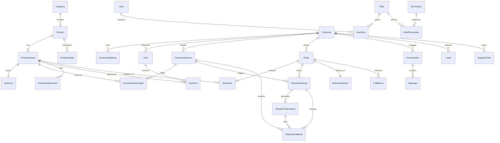

# 🗄️ LuxeWear Kenya — Database Schema Blueprint & ERD

> **Document Status**: PHASE 2 — SCHEMA BLUEPRINT REFINED, IMPLEMENTATION VALIDATION PENDING  
> **Version**: 1.1.0  
> **Database Engine**: PostgreSQL 15+  
> **ORM**: Prisma  

---

## 1. Complete Entity Relationship Diagram (ERD)



---

## 2. Enumerated Enums & State Machine Enums

```prisma
enum RoleName {
  SUPER_ADMIN
  STORE_MANAGER
  CUSTOMER_SUPPORT
  INVENTORY_CLERK
}

enum CustomerTier {
  ANONYMOUS
  LEAD
  FIRST_TIME_BUYER
  REPEAT_BUYER
  VIP_LUMINARY
  INACTIVE
}

enum CheckoutSessionStatus {
  ACTIVE
  PENDING_STK
  COMPLETED
  COMPLETED_LATE
  EXPIRED
  CANCELLED
}

enum ReservationStatus {
  ACTIVE
  RELEASED
  CONSUMED
  EXPIRED
  CANCELLED
}

enum PaymentStatus {
  PENDING
  SUCCESS
  FAILED
  TIMED_OUT
  REVERSED
  UNFULFILLED_LATE_PAYMENT
}

enum PaymentMethod {
  MPESA_STK
  MPESA_PAYBILL
  CARD
  STORE_CREDIT
}

enum CallbackStatus {
  RECEIVED
  PROCESSED
  DUPLICATE
  FAILED
  UNMATCHED
}

enum OrderStatus {
  PENDING_PAYMENT
  PAID
  PROCESSING
  SHIPPED
  DELIVERED
  CANCELLED
  REFUNDED
  LATE_PAYMENT_ESCALATED
}

enum FulfillmentStatus {
  UNFULFILLED
  PACKING
  DISPATCHED
  IN_TRANSIT
  DELIVERED
  FAILED_DELIVERY
}

enum MovementType {
  INITIAL_STOCK
  PURCHASE_DEDUCTION
  RESERVATION_LOCK
  RESERVATION_RELEASE
  MANUAL_ADJUSTMENT
  RETURN_RESTOCK
  DAMAGE_WRITE_OFF
}

enum OutboxStatus {
  PENDING
  PROCESSING
  PROCESSED
  FAILED
}

enum TicketStatus {
  OPEN
  IN_PROGRESS
  ESCALATED_HUMAN
  RESOLVED
  CLOSED
}
```

---

## 3. Stock Reservation & Availability Calculation Rules

- **PostgreSQL Source of Truth**:
  $$\text{Available Stock} = \text{Inventory.stock\_quantity} - \sum \text{InventoryReservation.quantity where status = 'ACTIVE' and expires\_at > NOW()}$$
- **Concurrency Protection**: Stock reservations are executed inside PostgreSQL explicit database transactions using `SELECT ... FOR UPDATE` row locks on the target `inventory` row. Redis acts purely as an optional distributed lock helper; if Redis is restarted, PostgreSQL state remains 100% authoritative and self-consistent.

---

## 4. Phase 2 Status & Next Validation Steps

- [x] Complete Entity Relationship Diagram (Mermaid ERD) mapped
- [x] All 10 core domain modules defined with exact data types & constraints
- [x] Enums and state machine transitions codified
- [x] Variant-level stock tracking & 15-minute reservation model hardened with `ReservationStatus`
- [x] Payment Callback state tracking enriched with `CallbackStatus`
- [x] Transactionally atomic Outbox Pattern (`outbox_events`) specified
- [x] `prisma/schema.prisma` file generated & validated against audit rules
- [ ] Database creation & PostgreSQL initial migration execution (`npx prisma migrate dev`)
- [ ] 12 Launch products seed script execution (`prisma/seed.ts`)
- [ ] Reservation lock & race condition integration tests

---
**Approved by**: LuxeWear Database & Engineering Team  
**Date**: September 25, 2026
