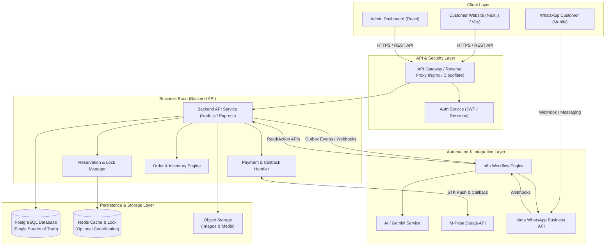
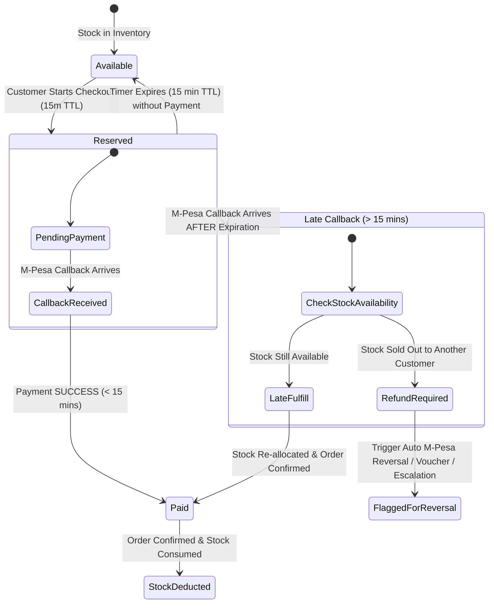

# 🏛️ LuxeWear Kenya — System Architecture Blueprint

> **Document Status**: APPROVED / PHASE 1 DELIVERABLE  
> **Version**: 1.1.0  
> **Prerequisite**: `LUXEWEAR_BUSINESS_SPECIFICATION.md`  

---

## 1. Core Architectural Axiom

```text
┌────────────────────────────────────────────────────────────────────────┐
│                        CORE ARCHITECTURAL RULE                         │
│                                                                        │
│   n8n orchestrates.  The backend decides.  PostgreSQL remembers.  AI interprets.   │
└────────────────────────────────────────────────────────────────────────┘
```

- **PostgreSQL**: The single immutable source of truth for all business entities (Products, Inventory, Reservations, Orders, Customers, Payments). Redis acts purely as an optional temporary coordination/cache layer. If Redis is restarted, PostgreSQL state is 100% self-sufficient and authoritative.
- **Backend API**: The sole authority for business logic, price calculation, authorization, stock allocation, and status transitions.
- **n8n Orchestrator**: Executes cross-system workflows, schedule triggers, and integration webhooks without holding domain state.
- **AI Agent**: Natural language parser and context interpreter operating strictly under backend-enforced API guardrails.

---

## 2. High-Level Application & Infrastructure Topology



---

## 3. Data Ownership & Boundary Matrix

| Entity | Primary Creator | Read Access | Modification Authority | Forbidden Modifiers | Source of Truth |
| :--- | :--- | :--- | :--- | :--- | :--- |
| `Product` & `ProductVariant` | Admin Panel | Public (Web, WA, n8n) | Admin API | Customer, n8n, AI | PostgreSQL |
| `Inventory` (Stock) | Admin Panel / System | Admin, API | Backend Order Engine | Customer, n8n, AI, Web | PostgreSQL |
| `InventoryReservation` | Backend API | Admin, API | Backend Order Engine | Customer, n8n, AI, Web | PostgreSQL |
| `CheckoutSession` | Customer Website | Customer, Admin | Backend API | Customer direct, AI | PostgreSQL |
| `PaymentAttempt` | Backend Payment Mgr | Admin, Customer (own) | Backend Payment Mgr | Frontend, n8n, AI | PostgreSQL |
| `PaymentTransaction` | M-Pesa Callback Endpoint | Admin, Customer (own) | Payment Callback Handler | Frontend, Admin, n8n | PostgreSQL |
| `Order` & `OrderItem` | Backend Order Engine | Customer (own), Admin | Backend Order Engine | Frontend, n8n, AI | PostgreSQL |
| `Customer` / `Lead` | Web / WA / API | Admin, n8n (for CRM) | Backend CRM Service | Frontend direct | PostgreSQL |
| `Fulfillment` | Admin / Dispatch API | Customer (own), Admin | Admin / Fulfillment API| Customer, AI | PostgreSQL |
| `OutboxEvent` | System Outbox | n8n, Admin | n8n (Status update) | Frontend, Customer | PostgreSQL |
| `AuditLog` | System Logger | Super Admin | Immutable (Append-only) | ALL (No edit/delete) | PostgreSQL |

---

## 4. 15-Minute Reservation Lock & M-Pesa Race Condition Strategy

### 4.1 Reservation Lifecycle & Timeout States



---

## 5. Phase 1 Definition of Done Checklist

- [x] Application topology & infrastructure component diagram defined
- [x] Data ownership and boundary matrix established for all core entities
- [x] 15-minute reservation lock mechanics & late M-Pesa callback race condition rules specified
- [x] Decoupled entity hierarchy designed (`Product`, `CheckoutSession`, `Order`, `Fulfillment`, `OutboxEvent`)
- [x] End-to-end Mermaid sequence diagrams created for Checkout, Late Callback, and WhatsApp AI
- [x] Reliability, idempotency, security, and observability standards defined

---
**Approved by**: LuxeWear Engineering Architecture Team  
**Date**: September 25, 2026
