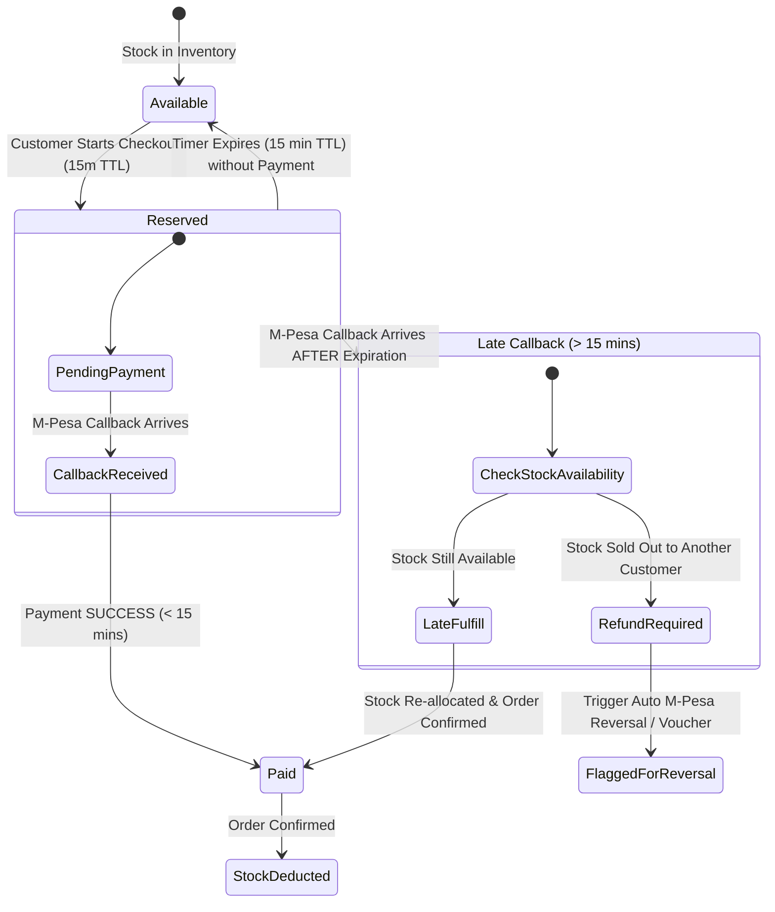
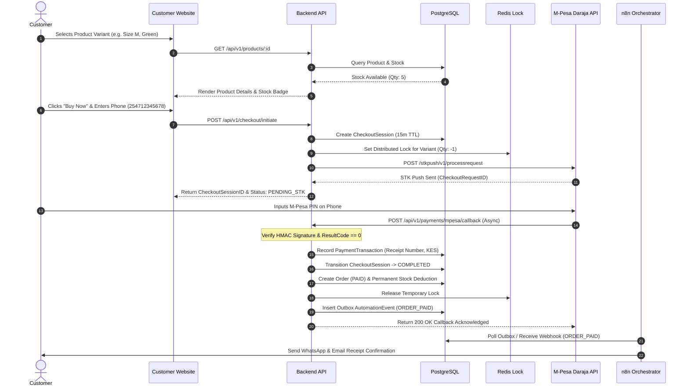
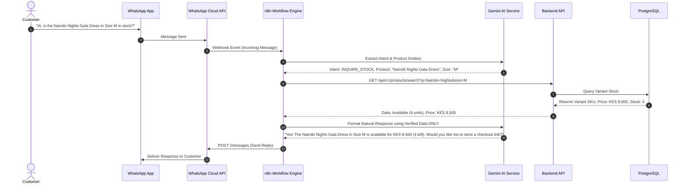

# 🏛️ LuxeWear Kenya — System Architecture Blueprint

> **Document Status**: REVIEW / PHASE 1 DELIVERABLE  
> **Version**: 1.0.0  
> **Prerequisite**: `LUXEWEAR_BUSINESS_SPECIFICATION.md`  

---

## 1. Core Architectural Axiom

```text
┌────────────────────────────────────────────────────────────────────────┐
│                        CORE ARCHITECTURAL RULE                         │
│                                                                        │
│   n8n orchestrates.  The backend decides.  PostgreSQL remembers.  AI interprets.   │
└────────────────────────────────────────────────────────────────────────┘
```

- **PostgreSQL**: The single immutable source of truth for all business entities (Products, Inventory, Orders, Customers, Payments).
- **Backend API**: The sole authority for business logic, price calculation, authorization, stock allocation, and status transitions.
- **n8n Orchestrator**: Executes cross-system workflows, schedule triggers, and integration webhooks without holding domain state.
- **AI Agent**: Natural language parser and context interpreter operating strictly under backend-enforced API guardrails.

---

## 2. High-Level Application & Infrastructure Topology


---

## 3. Data Ownership & Boundary Matrix

| Entity | Primary Creator | Read Access | Modification Authority | Forbidden Modifiers | Source of Truth |
| :--- | :--- | :--- | :--- | :--- | :--- |
| `Product` & `ProductVariant` | Admin Panel | Public (Web, WA, n8n) | Admin API | Customer, n8n, AI | PostgreSQL |
| `Inventory` (Stock) | Admin Panel / System | Admin, API | Backend Order Engine | Customer, n8n, AI, Web | PostgreSQL |
| `CheckoutSession` | Customer Website | Customer, Admin | Backend API | Customer direct, AI | PostgreSQL + Redis |
| `PaymentAttempt` | Backend Payment Mgr | Admin, Customer (own) | Backend Payment Mgr | Frontend, n8n, AI | PostgreSQL |
| `PaymentTransaction` | M-Pesa Callback Endpoint | Admin, Customer (own) | Payment Callback Handler | Frontend, Admin, n8n | PostgreSQL |
| `Order` & `OrderItem` | Backend Order Engine | Customer (own), Admin | Backend Order Engine | Frontend, n8n, AI | PostgreSQL |
| `Customer` / `Lead` | Web / WA / API | Admin, n8n (for CRM) | Backend CRM Service | Frontend direct | PostgreSQL |
| `Fulfillment` | Admin / Dispatch API | Customer (own), Admin | Admin / Fulfillment API| Customer, AI | PostgreSQL |
| `AutomationEvent` | System Outbox | n8n, Admin | n8n (Status update) | Frontend, Customer | PostgreSQL |
| `AuditLog` | System Logger | Super Admin | Immutable (Append-only) | ALL (No edit/delete) | PostgreSQL |

---

## 4. 15-Minute Reservation Lock & M-Pesa Race Condition Strategy

### 4.1 Reservation Lifecycle & Timeout States



### 4.2 Explicit Business Rules for Reservation & Callback Edge Cases

#### Rule A: Payment Success within 15 Minutes (< 15m)
1. Customer initiates checkout session.
2. Backend creates `CheckoutSession` (status: `ACTIVE`), sets `reservation_expires_at = NOW() + 15 mins`, and creates Redis distributed lock on variant stock.
3. Customer completes M-Pesa PIN entry.
4. M-Pesa callback arrives at minute 2.
5. Backend verifies signature & amount → Marks `CheckoutSession` as `COMPLETED`, creates `Order` (status: `PAID`), permanently deducts variant stock, and releases temporary lock.

#### Rule B: Expiration at 15 Minutes without Payment (= 15m)
1. Timer reaches 15 minutes without valid callback.
2. Background worker or lazy evaluation marks `CheckoutSession` as `EXPIRED`.
3. Redis lock automatically expires; reserved stock returns to available pool.

#### Rule C: Late M-Pesa Callback (> 15m) — Race Condition Resolution
If M-Pesa callback arrives at **Minute 16** (or later) for an `EXPIRED` session where payment actually succeeded:

1. **Step 1 — Verify Payment Authenticity**:
   - Backend verifies M-Pesa receipt number and confirms money was received in Daraja account.
2. **Step 2 — Check Current Inventory**:
   - Backend queries database: `SELECT stock_quantity FROM product_variants WHERE id = :variant_id FOR UPDATE;`
3. **Step 3A — If Stock IS Still Available**:
   - Backend converts `EXPIRED` session to `COMPLETED_LATE`.
   - Deducts 1 unit of stock.
   - Generates `Order` (status: `PAID`).
   - Sends notification: *"Your payment was received after timeout, but your order has been successfully placed!"*
4. **Step 3B — If Stock IS NO LONGER Available (Sold to another buyer)**:
   - Backend CANNOT fulfill order (prevents negative stock / over-selling).
   - Creates `PaymentTransaction` with status `UNFULFILLED_LATE_PAYMENT`.
   - Triggers automated M-Pesa Reversal request API OR creates a 100% value Store Credit Voucher.
   - Triggers urgent Admin alert in Dashboard for review.
   - Sends notification to customer: *"We received your payment of KES X, but the item went out of stock. A store credit voucher / M-Pesa reversal of KES X has been generated for you."*

---

## 5. Decoupled Entity Hierarchy & Schemas Overview

```text
Product (Catalog Item)
 └── ProductVariant (SKU, Size, Color, Stock)
      └── InventoryMovement (Audit of all stock changes)

Customer (Identity & CRM)
 ├── Lead (Pre-purchase interaction)
 └── Conversation (WhatsApp / Web chat history)
      └── Message

CheckoutSession (Transient Purchase Intent, 15m TTL)
 └── PaymentAttempt (STK Push invocation)
      └── PaymentTransaction (Authoritative Daraja callback log)

Order (Legal Purchase Contract)
 ├── OrderItem (Snapshot of ProductVariant, Price, Qty)
 ├── Delivery (Shipping address & tracking)
 └── Fulfillment (Packing, rider assignment, delivery status)

AutomationEvent (n8n Webhook & Outbox Queue)
 └── AuditLog (Immutable System Event Log)
```

---

## 6. End-to-End Flow Sequence Diagrams

### Flow 1: Customer Discovery to Checkout & M-Pesa Callback



---

### Flow 2: WhatsApp AI Inquiry & Verification Flow



---

## 7. Reliability, Security & Infrastructure Blueprint

### 7.1 Idempotency & Duplicate Protection
- All payment callbacks and n8n webhook triggers MUST include an `Idempotency-Key` or `MpesaReceiptNumber`.
- Backend checks if `MpesaReceiptNumber` already exists in `PaymentTransaction`. Duplicate callbacks return `200 OK` immediately without processing order twice.

### 7.2 Webhook Security Verification
- **M-Pesa Callbacks**: Validated against Daraja Passkey hash and whitelisted Safaricom IP ranges.
- **n8n / WhatsApp Webhooks**: Validated using `X-LuxeWear-Signature` (HMAC-SHA256 of payload with shared secret).

### 7.3 Rate Limiting & Abuse Prevention
- API Endpoints rate-limited via Nginx / Express Rate Limit (e.g. max 5 checkout requests per minute per IP/Phone).

### 7.4 Logging & Observability
- **Application Logs**: Structured JSON logs (`timestamp`, `trace_id`, `service`, `level`, `message`).
- **Audit Logs**: Immutable database table tracking all administrative edits, price updates, inventory adjustments, and status changes.

---

## 8. Phase 1 Definition of Done Checklist

- [x] Application topology & infrastructure component diagram defined
- [x] Data ownership and boundary matrix established for all 10 core entities
- [x] 15-minute reservation lock mechanics & late M-Pesa callback race condition rules specified
- [x] Decoupled entity hierarchy designed (`Product`, `CheckoutSession`, `Order`, `Fulfillment`, `AutomationEvent`)
- [x] End-to-end Mermaid sequence diagrams created for Checkout, Late Callback, and WhatsApp AI
- [x] Reliability, idempotency, security, and observability standards defined

---
**Approved by**: LuxeWear Engineering Architecture Team  
**Date**: September 25, 2026
